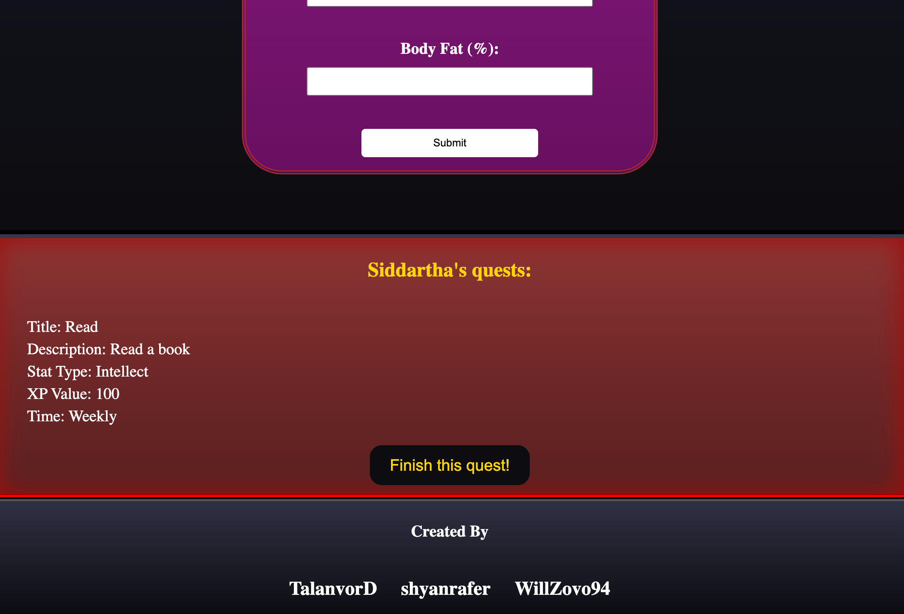
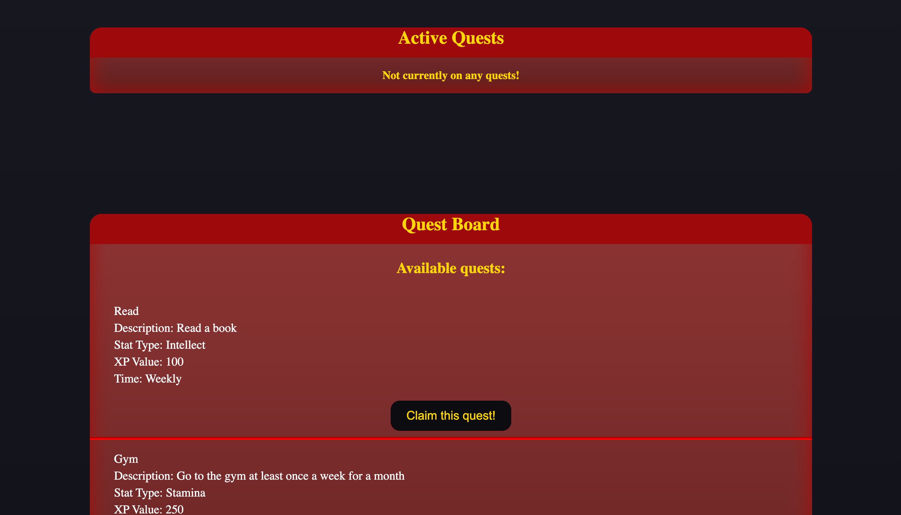
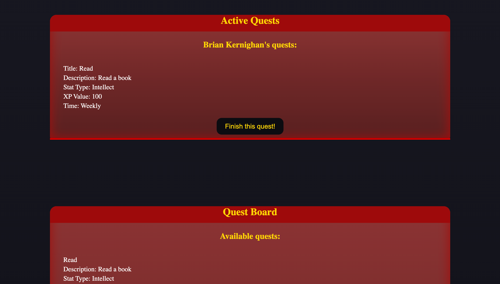

# FitQuest

## Description
Gameified fitness app that uses medieval rpg elements as inspiration.

## Table of contents

- [Credit](#credit)
- [License](#installation)
- [Usage](#usage)
- [Contributing](#contributing)
- [Questions](#questions)
- [Contact](#contact)
- [Screenshots](#screenshots)

## Credit
Canva was used for the following images... greathall.jpg, roguefq.png, vitalityfq.png, warriorfq.png, wizardfq.png. 
  
Starter code provided from JWT-Review assigntment (week 22 assignment 18).
  
We did receive some assistance from the teacher and TA on the following: Xp bar and user inputting stats.

## License
  
Notice: This project is licensed with a MIT license. More information pertaining to the given license is provided in the link below.  
https://www.mit.edu/~amini/LICENSE.md

## Usage
This is a demonstration of capcity by Christopher Glenn, Ryan Shaffer, and William Zovistoski.

## Contributing
Fork, make edits, submit for review.

## Questions
Repo link: https://github.com/TalanvorD/FitQuest  
Deployed link: https://fitquest-z9km.onrender.com/
  
TECH USED:  
HTML, CSS, React.js, JavaScript, Git, Render, GraphQL, canvas, MongoDB, mongoose, bcrypt, express, jwt, vite

## Contact
Best mode of contact: Ping on Github  
Contact info:   
Chris: https://github.com/TalanvorD  
Ryan: https://github.com/shyanrafer  
Will: https://github.com/WillZovo94
[Back to top](#FitQuest)

## Screenshots

 
More SC to come
